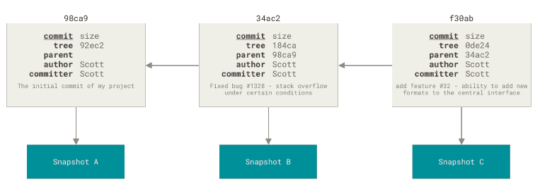
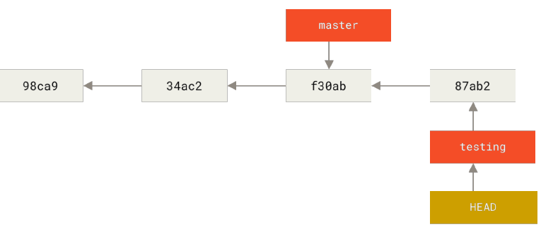
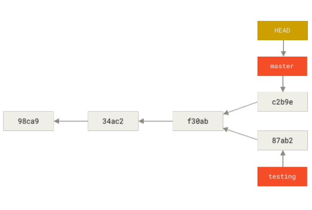

# Aula 2 - Navegação e referências

---

## Objetivos da Aula 2

- Entender Braching, Merging e Rebase do GIT
- Git em Servidores (HTTP, SSH) - Configuração de chaves
- Trabalho distrubuído com GIT

---

## Tabela de conteúdos

- [Aula 2 - Navegação e referências](#aula-2---navegação-e-referências)
  - [Objetivos da Aula 2](#objetivos-da-aula-2)
  - [Tabela de conteúdos](#tabela-de-conteúdos)
  - [O que é uma Branch? - 1/3](#o-que-é-uma-branch---13)
  - [O que é uma Branch? - 2/3](#o-que-é-uma-branch---23)
  - [O que é uma Branch? - 3/3](#o-que-é-uma-branch---33)
  - [Trabalhando com Branches - 1/3](#trabalhando-com-branches---13)
  - [Trabalhando com Branches - 2/3](#trabalhando-com-branches---23)
  - [Trabalhando com Branches - 3/3](#trabalhando-com-branches---33)
  - [Prática - Branches](#prática---branches)
  - [Stashing - 1/2](#stashing---12)
  - [Stashing - 2/2](#stashing---22)

---

<!-- TODO: Adicionar revisão de comandos e teoria da ultima aula -->

## O que é uma Branch? - 1/3

Antes de explicar o que é uma branch, vamos voltar um pouco e entender o que é um commit

<!-- Quando você faz um commit executando git commit, o Git verifica cada subdiretório (neste caso,
apenas o diretório raiz do projeto) e armazena esses objetos no repositório do Git. O Git então cria
um objeto de commit que possui os metadados e um ponteiro para a raiz do projeto para que ele
possa recriar aquele snapshots quando necessário.
Resumir isso
 -->

- Quando você faz um commit, o Git armazena um objeto de commit no repositório do Git (./git/objects)
- Cada commit possui metadados e ponteiros para os "blobs" (arquivos) que foram alterados

---

## O que é uma Branch? - 2/3

Se você commitar novamente, o proximo commit terá um ponteiro para o commit anterior

<!-- REVIEW: A definição de snapshot esta certa? -->
- Cada commit vai ter um ponteiro para uma snapshot (conjunto de arquivos e suas respectivas modificações)
- O Git é um grafo acíclico direcionado

---

## O que é uma Branch? - 3/3

Enfim, chegamos em o que é uma branch

- Uma branch é um ponteiro para um commit
- O nome padrão do branch principal é `master` (recomendado mudar para `main`)
- Todas as vezes que você commita, este ponteiro é atualizado para o commit mais recente
- Esse ponteiro é chamado de `HEAD`

---

## Trabalhando com Branches - 1/3

Ao criar uma branch, você cria um novo ponteiro para seu commit atual

- Você pode criar uma branch com o comando `git branch <nome da branch>`

**NOTA:** Ao criar uma branch, você não muda de branch, você continua na branch atual

---

## Trabalhando com Branches - 2/3

Então, como eu mudo de branch?

- Você pode mudar de branch com o comando `git switch <nome da branch>` ou `git checkout <nome da branch>`

Suponha então que você troque de branch e crie um novo commit

---

## Trabalhando com Branches - 3/3

Deste modo, você pode alternar entre branches e criar commits em cada uma delas

- Cada branch é independente uma da outra

Aqui chegamos em um ponto crucial do Git, ao ter duas branches, você pode fazer um merge entre elas

---

## Prática - Branches
<!-- NOTE: A prática será ao vivo junto dos alunos -->

Dentro do repositório da aula 1, crie uma branch chamada `aula2` e faça um commit nela

**Pré-requisitos:** Garanta que a sua branch atual tem ao menos um commit e que você está na branch `main`, para isso:

1. Use o comando `git log` para ver os commits (caso não tenha, commite algo)
2. caso sua branch principal não se chame `main`, use o comando `git branch -M <nome da branch>` para renomear a branch

**Prática:**

- Auxilio: `git branch` para saber qual branch você está
- Auxilio: `git log --oneline --graph --decorate --all` para ver o grafo de commits

- Use o comando `git branch <nome da branch>` para criar uma branch
- Use o comando `git switch <nome da branch>` para mudar de branch
- Em sua nova branch, commite um novo arquivo ou altere um arquivo existente (veja o grafo de commits)
- Use o comando `git switch main` para voltar para a branch principal
- Faça um novo commit de um arquivo diferente ou uma modificação diferente (veja o grafo de commits)

---

## Stashing - 1/2

Há um local temporário onde o Git armazena as modificações que você fez mas não commitou

- `git stash` - Salva as modificações atuais em um local temporário

o git stash é util quando você quer mudar de branch mas não quer commitar suas modificações (por exemplo, quando você está no meio de uma funcionalidade e precisa mudar de branch para corrigir um bug)

---

## Stashing - 2/2

<!-- TODO: Colocar exemplos e criar demonstração de uso -->

- `git stash list` - Lista os stashes
- `git stash apply` - Aplica o stash mais recente no seu branch atual (não remove o stash)
- `git stash pop` - Aplica o stash mais recente no seu branch atual (remove o stash)
- `git stash drop` - Remove o stash mais recente (não aplica o stash)
- `git stash clear` - Remove todos os stashes
- `git stash show` - Mostra as modificações do stash mais recente

**NOTA:** Todos os comandos a cima podem receber um argumento para especificar o stash que você quer aplicar/remover/exibir
Exemplo: `git stash apply stash@{2}`

