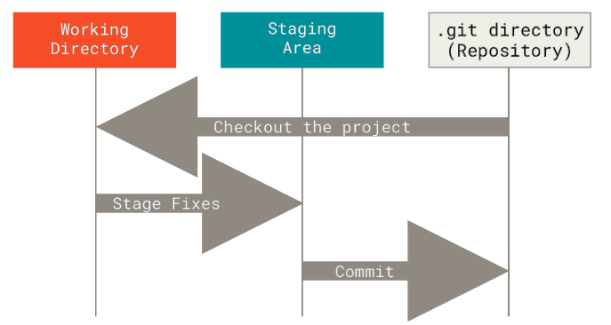
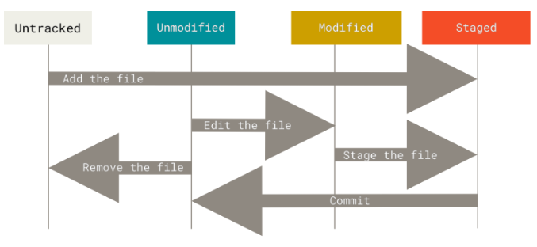
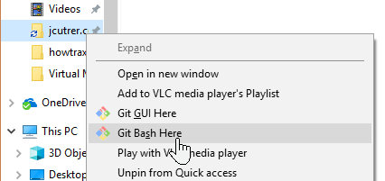
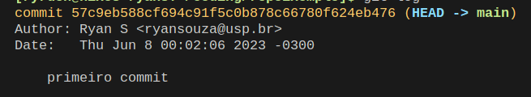

## Aula 1 - Introdução ao Git

---

### Objetivos da Aula 1

- Entender o Controle de Versão
- Como lidar com o git e seus comandos
- Como subir o seu primeiro repositório

---

<!-- O Básico do Git -->
### O que é Git?

- Sistema com a finalidade de gerenciar diferentes versões de um mesmo documento
- O Git é uma das maiores ferramenta Open Source da atualidade, Todas as empreas de tecnologia utilizam Git
- Criado por Linus Torvalds (Mesmo criador do Unix e do Linux) em linguagem C

Sua ideia é simples: salvar as alterações de um arquivo em um determinado momento e permitir tirar informações sobre o que foi alterado, quando e por que e quem fez a alteração.


---

### O que é Github?

<!-- TODO: Melhorar descrição do github -->
- Serviço de Web compartilhado para projetos que utilizam Git
- Criado por Tom Preston-Werner em Ruby


---

### Por que usar Git?

- Histórico de alterações do seu projeto
<!-- TODO: Deixar uma citação do livro Pro-Git Página 11 -->
- Projeto simples
- Velocidade, Segurança e backup
- Forte suporte para desenvolvimento não-linear (milhares de ramos paralelos)
- Completamente distribuído (permite que desenvolvedores trabalhem em qualquer lugar sem depender de um servidor central)
- Capaz de lidar com projetos grandes como o núcleo o Linux com eficiência (velocidade e
tamanho dos dados)

---

### Ciclo de vida dos arquivos: Os Três Estados - 1/3

<!-- TODO: Deixar uma citação do livro Pro-Git Página 14 -->
- Esta é a **principal** coisa a lembrar sobre Git se você quiser que o resto do seu processo de aprendizagem ocorra sem problemas
- Os três estados principais que seus arquivos podem ocupar em um repositório Git:
  - **Untracked**: Arquivos que não estão sendo rastreados pelo Git
  - **Staged**: Arquivos que estão sendo rastreados pelo Git e estão prontos para serem commitados
  - **Unmodified**: Arquivos que estão sendo rastreados pelo Git e não foram alterados desde o último commit



O fluxo de trabalho básico do Git é algo assim:

1. Você modifica arquivos no seu diretório de trabalho.
2. Você prepara os arquivos, adicionando-os ao seu área de preparação. (stage area)
3. Você faz commit, o que leva os arquivos como eles estão no seu diretório de preparação e os armazena permanentemente no seu diretório Git.

---

### Ciclo de vida dos arquivos - 2/3

Agora que você entendeu os três principais estados de um repositório Git, vamos entender como cada arquivo se comporta dentro do repositório



Vamos passar por cada um desses estados hoje

---

### Instalando o git

- Windows: <https://git-scm.com/download/win>
- Linux: <https://git-scm.com/download/linux>
- Mac: <https://git-scm.com/download/mac>

---

### Configurações iniciais

Definindo seu nome e email padrão para controle de histórico

```bash
git config --global user.name "Seu Nome"
git config --global user.email "seu email"
```

Definindo o editor de texto padrão para escrita de mensagens

```bash
git config --global core.editor "code" # vscode
git config --global core.editor "subl" # sublime
git config --global core.editor "vim" # vim
```

Para verificar as configurações

```bash
git config --list
```

---

### Criando um repositório

Temos duas formas de criar um repositório, você cria um ou você clona um

- Criando um repositório: `git init`

```bash
mkdir nome-da-pasta
cd nome-da-pasta
git init
```

- Clonando um repositório: `git clone <url-do-repositorio>`

```bash
git clone https://github.com/gelos-icmc/workshop-git-2023 # exemplo
```

Para quem está no Windows: botão direito do mouse na pasta criada > Git Bash Here > git init



---

### Comandos básicos

Antes de mostrar os comandos vamos defini-los

- `git status`: mostra o estado atual do repositório
- `git add <caminho-do-arquivo>`: adiciona o arquivo ao staged
- `git commit -m "mensagem do commit"`: salva as alterações no repositório
- `git log`: mostra o histórico de commits

---

### Exemplo de uso

Vamos criar um arquivo html com o nome index.html com o texto `Olá Mundo` e vamos adicionar ele ao nosso repositório

Uma vez com o repositorio criado (git init) e o arquivo criado (index.html) vamos verificar o status do repositório

---

### Exemplo de uso - 1/3

código html do arquivo index.html para quem quiser copiar

```html
<!DOCTYPE html>
<html lang="pt-br">

<head>
 <meta charset="UTF-8">
 <meta http-equiv="X-UA-Compatible" content="IE=edge">
 <meta name="viewport" content="width=device-width, initial-scale=1.0">
 <title>Workshop Git 2023</title>
</head>

<body>
 <h1>Olá mundo!</h1>
</body>

</html>
```

---

### Exemplo de uso - 2/3

Executem na máquina de vocês

```bash
ls # lista os arquivos da pasta
git status # verifica o status do repositório
git add index.html # adiciona o arquivo ao staged
git status # (agora o arquivo está no staged)
git commit -m "primeiro commit" # salva as alterações
git status # (agora o arquivo está no unmodified)
```

---

### Exemplo de uso - 3/3

Vocês vão ver alguma coisa parecida com isso ao executar o git status

```bash
On branch main
Your branch is up-to-date with 'origin/main'.
Changes to be committed:
  (use "git reset HEAD <file>..." to unstage)

    new file: index.html

Changes not staged for commit:
  (use "git add <file>..." to update what will be committed)
  (use "git checkout -- <file>..." to discard changes in working directory)
    
    modified: README.md
```

---

### Visualizando alterações

Agora, você fez o seu primeiro commit! vamos aprender a ver o histórico de commits

```bash
git log # mostra o histórico de commits
```



Se você quiser ver o histórico de commits de uma forma mais resumida você pode usar o comando `git log --oneline`

---

### Git Tem Integridade: Hash - 1/1

<!-- TODO: citação ao livro pro-git página 13 -->

- Tudo no Git passa por uma soma de verificações (checksum) antes de ser armazenado e é refereciado por esse checksum
- Isso significa que é impossível alterar o conteúdo de um arquivo sem que o Git saiba

- O mecanismo que o Git usa para essa verificação é chamado de SHA-1 hash, que é uma sequência de 40 caracteres hexadecimais (0-9 e a-f) calculados com base no conteúdo do arquivo

`24b9da6552252987aa493b52f8696cd6d3b00373`

Você vai ver esses valores de hash em todo o lugar do Git porque ele os usa com frequência. Na verdade, Git armazena tudo não pelo nome do arquivo, mas pelo valor de hash do seu conteúdo.

### Git Tem Integridade: Somente adição - 1/2

O Git só adiciona informações ao repositório, ele nunca altera ou exclui informações

- Você nunca pode perder informações se elas forem adicionadas ao Git
- Isso faz com que seja muito díficil fazer algo no sistema que não seja reversível ou fazê-lo apagar dados de forma
alguma
- Fica mais díficil ainda perder dados se você commitar regularmente e enviar seus dados para outro repositório

---

### Visualizando alterações com mais detalhes - 1/2

Sabemos que podemos usar o git log para ver o histórico de commits, mas e se quisermos ver as alterações que foram feitas em cada commit?

- `git log -p`: mostra o histórico de commits com as alterações feitas em cada commit
- `git log -p -2`: mostra as duas últimas alterações feitas no repositório
- `git log --stat`: mostra o histórico de commits com as alterações em arquivos e quantas linhas foram adicionadas e removidas

Você consegue ver uma "linha histórica" dos commits usando o comando `git log --graph` (Conceito de branch, que vamos ver mais tarde)

Eu recomendo que vocês usem o comando `git log --oneline --graph --all` para ver o histórico de commits de uma forma mais resumida e visual

---

### Visualizando alterações com mais detalhes - 2/2

Eu já sei qual commit específico eu quero ver as alterações, como eu faço agora? Vou ter que contar??

- `git show <hash-do-commit>`: mostra as alterações feitas no commit especificado (O hash pode ser abreviado, mas tem que ser único)

---

### Pedindo Ajuda

Git possui muitos comandos e muitos deles você vai se esquecer como usar corretamente ou vai querer saber mais sobre eles

Para isso você pode simplesmente pedir ajuda para o git

```bash
git help <comando>
git <comando> --help
man git-<comando> # linux
```

Exemplo:

```bash
git help show # vai abrir uma página com a documentação do comando show
```

Todos esses comandos podem ser acessados sem internet e caso eles a informação que você precisa não esteja lá você pode acessar a documentação do git em <https://git-scm.com/docs> e pesquisar pelo comando que você precisa
<!-- O Básico do Git -- FIM -->

---

### Dúvidas e testes de conhecimento

<!-- TODO: elaborar questões simples e fáceis para que os alunos respondam de modo a fixar o conteúdo teórico -->
<!-- Dar enfoque a 3 coisas: Estados, Hash e ciclo de comandos -->

### Github - Repositório Remoto

