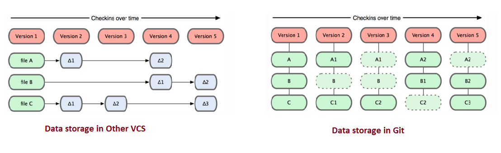

## Aula 1 - Introdução ao Git

---

### Objetivos da Aula 1

- Entender o Controle de Versão
- Como lidar com o git e seus comandos
- Como subir o seu primeiro repositório

---

### O que é Git?

- Sistema com a finalidade de gerenciar diferentes versões de um mesmo documento
- Criado por Linus Torvalds em C de modo a ser distribuído & Open Source



---

### O que é Github?

- Serviço de Web compartilhado para projetos que utilizam Git
- Criado por Tom Preston-Werner em Ruby


---

### Por que usar Git?

- Histórico de alterações do seu projeto
- Trabalho em equipe de forma organizada
- Segurança e backup
- Trabalho assíncrono

---

### Instalando o git

- Windows: <https://git-scm.com/download/win>
- Linux: <https://git-scm.com/download/linux>
- Mac: <https://git-scm.com/download/mac>

---

### Configurações iniciais

Definindo seu nome e email padrão para controle de histórico

```bash
git config --global user.name "Seu Nome"
git config --global user.email "seu email"
```

Definindo o editor de texto padrão para escrita de mensagens

```bash
git config --global core.editor "code" # vscode
git config --global core.editor "subl" # sublime
git config --global core.editor "vim" # vim
```

Para verificar as configurações

```bash
git config --list
```

---

### Criando um repositório

Comandos para criar uma pasta e inicializar um repositório

```bash
mkdir nome-da-pasta
cd nome-da-pasta
git init
```

Para quem está no Windows: botão direito do mouse na pasta criada > Git Bash Here > git init


---

### Ciclo de vida dos arquivos - 1/2

Untracked: arquivo não está sendo monitorado pelo git

Unmodified: arquivo monitorado pelo git mas não foi alterado desde o último commit

Modified: arquivo foi alterado

Staged: arquivo está pronto para ser commitado (salvo)

---

### Ciclo de vida dos arquivos - 2/2


Vamos passar por cada um desses estados hoje

---

### Comandos básicos

Antes de mostrar os comandos vamos defini-los

- `git status`: mostra o estado atual do repositório
- `git add <caminho-do-arquivo>`: adiciona o arquivo ao staged
- `git reset <caminho-do-arquivo>`: remove o arquivo do staged
- `git commit -m "mensagem do commit"`: salva as alterações no repositório
- `git log`: mostra o histórico de commits

---

### Exemplo de uso

Vamos criar um arquivo html com o nome index.html com o texto Olá Mundo e vamos adicionar ele ao nosso repositório

Uma vez com o repositorio criado (git init) e o arquivo criado (index.html) vamos verificar o status do repositório

---

### Exemplo de uso - 1/2

código html do arquivo index.html para quem quiser copiar

```html
<!DOCTYPE html>
<html lang="pt-br">

<head>
 <meta charset="UTF-8">
 <meta http-equiv="X-UA-Compatible" content="IE=edge">
 <meta name="viewport" content="width=device-width, initial-scale=1.0">
 <title>Workshop Git 2023</title>
</head>

<body>
 <h1>Olá mundo!</h1>
</body>

</html>
```

---

### Exemplo de uso - 2/3

Executem na máquina de vocês

```bash
ls # lista os arquivos da pasta
git status # verifica o status do repositório
git add index.html # adiciona o arquivo ao staged
git status # (agora o arquivo está no staged)
git commit -m "primeiro commit" # salva as alterações
git status # (agora o arquivo está no unmodified)
```

---

### Exemplo de uso - 3/3

Você fez o seu primeiro commit! Agora vamos ver o histórico de commits e entender o que aconteceu

```bash
git log # mostra o histórico de commits
```

---

### Git log - 1/2

